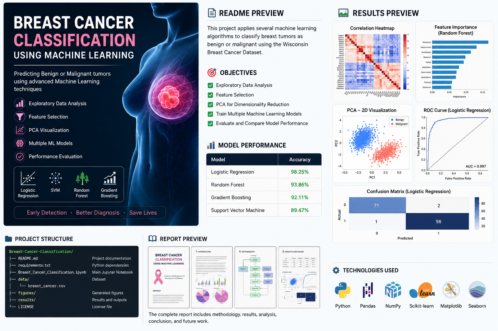

# Breast Cancer Classification Using Machine Learning
# Breast Cancer Classification Using Machine Learning

<p align="center">
  
</p>
## Overview

Breast cancer is one of the most common cancers worldwide, and early diagnosis plays a crucial role in improving patient survival. This project applies several machine learning algorithms to classify breast tumors as **benign** or **malignant** using the Wisconsin Breast Cancer Dataset.

The project follows a complete machine learning pipeline, including exploratory data analysis (EDA), data preprocessing, feature selection, dimensionality reduction using Principal Component Analysis (PCA), model training, and performance evaluation.


---

## Objectives

- Explore and understand the breast cancer dataset.
- Perform exploratory data analysis using statistical and graphical methods.
- Preprocess the dataset for machine learning.
- Apply feature selection techniques to identify the most informative features.
- Reduce feature dimensionality using Principal Component Analysis (PCA).
- Train multiple machine learning classification models.
- Compare model performance using standard evaluation metrics.

---

## Dataset

**Dataset:** Wisconsin Breast Cancer Dataset

### Dataset Information

- Total samples: **569**
- Features: **30 numerical features**
- Target classes:
  - Benign (0)
  - Malignant (1)

The features describe characteristics computed from digitized images of fine needle aspirates (FNA) of breast masses.

---

# Project Structure

```
Breast-Cancer-Classification/
│
├── README.md
├── requirements.txt
├── Breast_Cancer_Classification.ipynb
│
├── data/
│   └── breast_cancer.csv
│
├── figures/
│
├── results/
│
└── LICENSE
```

---

# Machine Learning Workflow

```
Dataset
   │
   ▼
Data Loading
   │
   ▼
Exploratory Data Analysis
   │
   ▼
Data Preprocessing
   │
   ▼
Feature Selection
   │
   ▼
Principal Component Analysis (PCA)
   │
   ▼
Model Training
   │
   ▼
Model Evaluation
   │
   ▼
Performance Comparison
```

---

# Exploratory Data Analysis

The exploratory analysis includes:

- Dataset inspection
- Missing value analysis
- Statistical summary
- Pair plots
- Bar charts
- Pie charts
- Histograms
- Density plots
- Box plots
- Correlation matrix
- Correlation heatmap

These visualizations help understand feature distributions and relationships before model training.

---

# Data Preprocessing

The preprocessing stage consists of:

- Label encoding of the diagnosis variable
- Train-test split
- Feature standardization using StandardScaler

---

# Feature Selection

Three feature selection techniques are applied:

- Recursive Feature Elimination (RFE)
- Random Forest Feature Importance
- Mutual Information

The selected features are combined and used for model training.

---

# Dimensionality Reduction

Principal Component Analysis (PCA) is applied to visualize the dataset in a lower-dimensional space.

The project includes:

- PCA transformation
- Explained variance analysis
- Scree plot
- Three-dimensional PCA visualization

---

# Machine Learning Models

The following classification algorithms are implemented:

- Logistic Regression
- Support Vector Machine (SVM)
- Random Forest
- Gradient Boosting

---

# Model Evaluation

Each model is evaluated using:

- Accuracy
- Precision
- Recall
- F1-score
- Confusion Matrix
- ROC Curve
- Area Under the Curve (AUC)

---

# Results

The models achieved high classification performance on the Wisconsin Breast Cancer Dataset.

| Model | Accuracy |
|--------|----------|
| Logistic Regression | 98.25% |
| Random Forest | 93.86% |
| Gradient Boosting | 92.11% |
| Support Vector Machine | 89.47% |

Logistic Regression achieved the highest overall classification accuracy in this implementation.

---

# Libraries Used

- Python
- NumPy
- Pandas
- Matplotlib
- Seaborn
- Plotly
- Scikit-learn

---

# Installation

Clone the repository:

```bash
git clone https://github.com/ZahraAlipour703/BreastCancer.git
```

Navigate to the project folder:

```bash
cd BreastCancer
```

Install the required libraries:

```bash
pip install -r requirements.txt
```

---

# Usage

Launch the notebook:

```bash
jupyter notebook breast_cancer_classification.ipynb
```

or execute the Python script:

```bash
python breast_cancer_classification.py
```

---

# Future Improvements

Possible extensions include:

- Hyperparameter optimization using GridSearchCV
- Cross-validation
- SHAP explainability
- Feature engineering
- Deep learning approaches
- Web deployment using Streamlit or Flask

---

# Author

**Zahra Alipour**

Computer Vision Engineer

---
